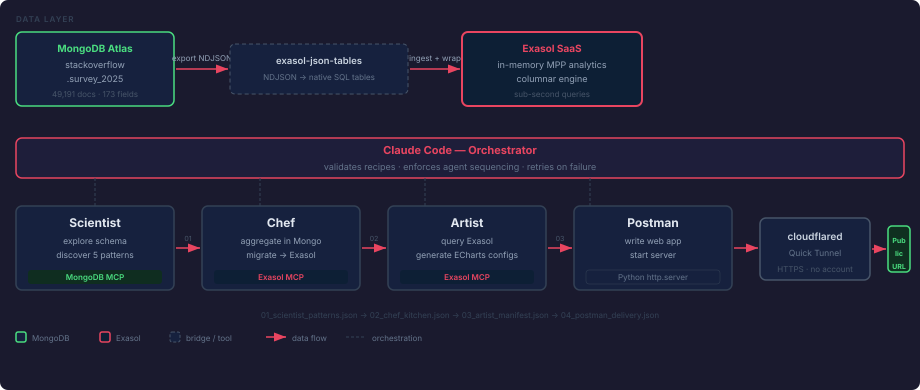
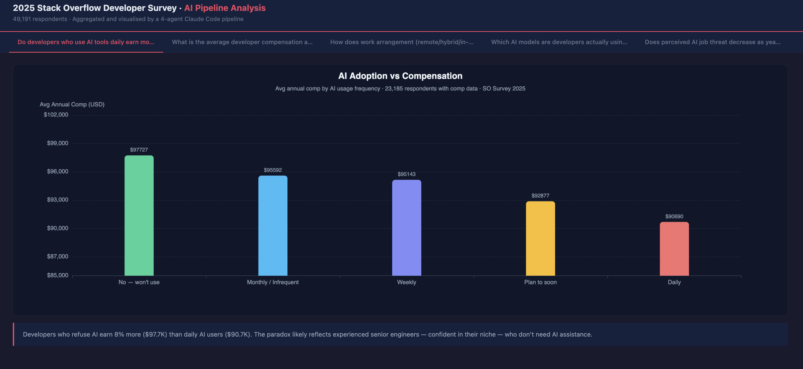
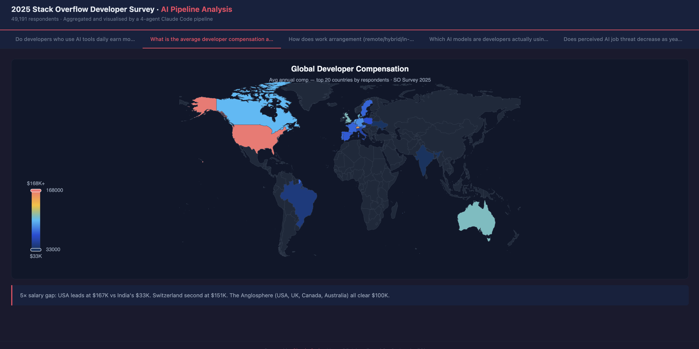
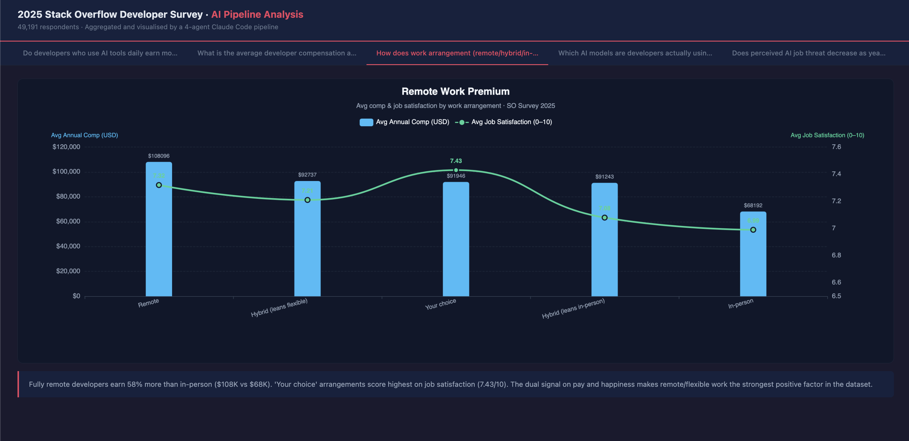
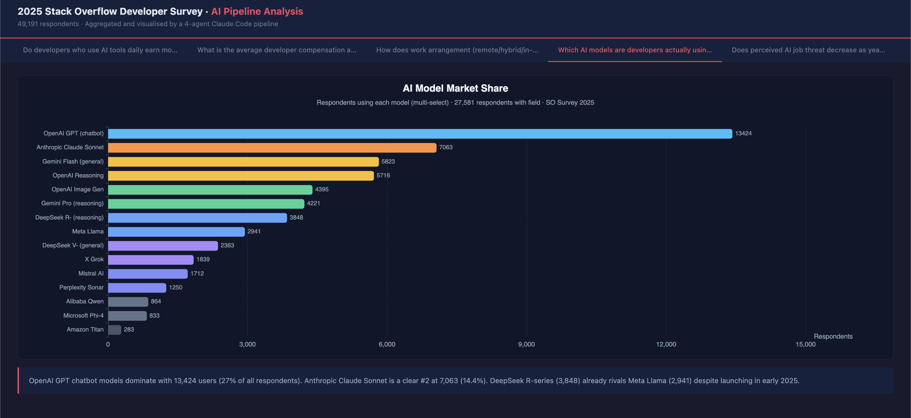
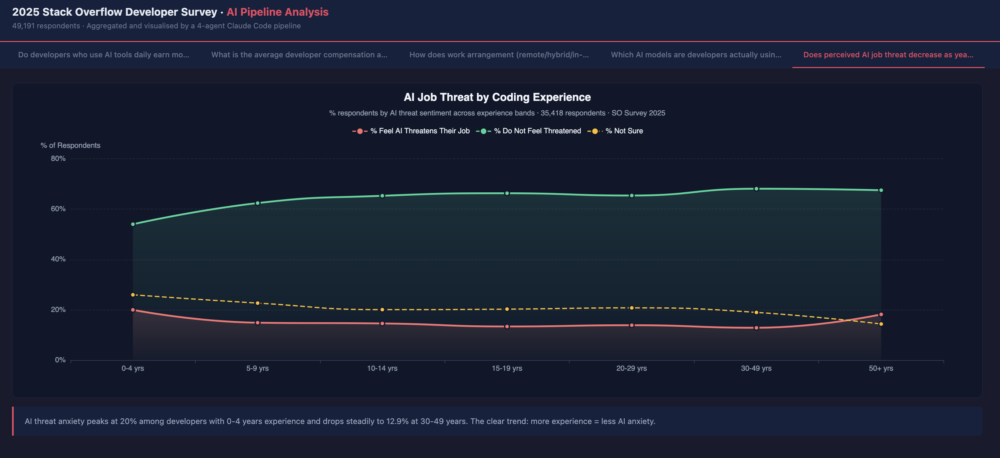

# MCP Agentic Data Pipeline

A 4-agent Claude Code pipeline that explores a **MongoDB** collection, runs analytics (with optional **Exasol** SQL), renders interactive ECharts visualisations, and publishes a live data app — end to end, from a single prompt.

---

## What this is

Point it at any MongoDB collection. Say **"Run full pipeline."** Four specialised agents — Scientist, Chef, Artist, Postman — discover patterns, run aggregations, render Apache ECharts charts, and publish a public URL via a cloudflared tunnel. No human steps between raw data and live app.

Built for developers who want to see what AI-native data engineering looks like in practice.

> **Why Exasol:** Exasol is the analytics engine — its in-memory MPP architecture delivers sub-second query performance on the full dataset, even on a free-trial instance.

Demonstrated here on the [2025 Stack Overflow Developer Survey](https://survey.stackoverflow.co/2025) — 49,191 developers across 177 countries.

---

## How it works



Chef runs MongoDB aggregations and writes structured JSON results. Artist reads that JSON and generates ECharts configs. Exasol MCP is available to Chef for optional SQL analytics if connected. Each agent reads the previous recipe file, validates `status: "complete"`, does its work, and writes its own. Any failure stops the pipeline immediately and reports which agent broke and why.

| Agent | Data source | What it does |
|-------|-------------|--------------|
| **Scientist** | MongoDB MCP | Explores schema, discovers 5 chart-worthy cross-dimensional patterns |
| **Chef** | MongoDB MCP (+ Exasol MCP optional) | Runs aggregations, shapes data into ECharts-ready series, writes structured JSON |
| **Artist** | Chef recipe (local JSON) | Reads structured data, generates complete Apache ECharts option configs |
| **Postman** | Artist recipe (local JSON) | Writes the data app, starts Python server, opens cloudflared public tunnel |

---

## Run it yourself

Works with **any** MongoDB collection — swap the Stack Overflow survey for your own data in step 1.

### Prerequisites

| Tool | Install |
|------|---------|
| Python 3.10+ | `brew install python` or [python.org](https://python.org) |
| Claude Code | `npm install -g @anthropic-ai/claude-code` |
| MongoDB Atlas | Free M0 at [cloud.mongodb.com](https://cloud.mongodb.com) |
| MongoDB MCP Server | See MCP config below |
| Exasol | See "Getting Exasol" below |
| Exasol MCP Server | See MCP config below |
| cloudflared | `brew install cloudflare/cloudflare/cloudflared` |

### Getting Exasol

**Option A — Exasol SaaS** *(recommended — $200 free trial, no card required)*
Sign up at [cloud.exasol.com/signup](https://cloud.exasol.com/signup)

**Option B — Exasol Personal** *(free, no expiry, single user, runs locally)*
```bash
curl https://downloads.exasol.com/exasol-personal/installer.sh | sh
```

**Option C — Exasol Community Edition** *(free VM, up to 200 GB)*
Download at [Exasol Community Edition](https://github.com/exasol-labs/exasol-labs-community-edition)

### MCP server config (`~/.claude/settings.json`)

```json
{
  "mcpServers": {
    "mongodb-mcp": {
      "command": "npx",
      "args": ["-y", "mongodb-mcp-server"],
      "env": {
        "MDB_MCP_CONNECTION_STRING": "mongodb+srv://<user>:<pass>@<cluster>.mongodb.net/"
      }
    },
    "exasol-mcp": {
      "command": "uvx",
      "args": ["exasol-mcp"],
      "env": {
        "EXASOL_HOST": "<your-exasol-host>",
        "EXASOL_USER": "<your-user>",
        "EXASOL_PASSWORD": "<your-password>"
      }
    }
  }
}
```

### Steps

1. **Load your data into MongoDB Atlas** — any collection, any schema. For the Stack Overflow example: download the 2025 survey CSV from [survey.stackoverflow.co/2025](https://survey.stackoverflow.co/2025), import it into `stackoverflow.survey_2025`.

2. **Clone and open in Claude Code**
   ```bash
   git clone https://github.com/mosra03/mcp-agentic-data-pipeline.git
   cd mcp-agentic-data-pipeline
   claude
   ```

3. **Verify your MCP connections**
   ```
   /mcp
   ```
   Both servers must show as connected before running the pipeline:
   ```
   mongodb-mcp: npx ... — ✓ Connected
   exasol-mcp:  uvx ... — ✓ Connected
   ```

4. **Run the full pipeline with one prompt**
   ```
   Run full pipeline
   ```
   Or run agents individually to debug or re-run a single stage:
   ```
   Run agent 1 - Scientist
   Run agent 2 - Chef
   Run agent 3 - Artist
   Run agent 4 - Postman
   ```

5. **Open your live URL** — printed at the end of Agent 4. Works in any browser, no login.

> The `data-pipeline-analyst` skill in `skills/` auto-loads in Claude Code, giving every agent full pipeline context without re-reading the repo each time.

---

## Dataset used

[2025 Stack Overflow Developer Survey](https://survey.stackoverflow.co/2025) — 49,191 developers, 177 countries, 173 fields. Covers compensation, AI tool adoption, remote work arrangements, job satisfaction, programming languages, and more.

---

## Built with Exasol Labs

| Tool | How it's used |
|------|---------------|
| [exasol-json-tables](https://github.com/exasol-labs/exasol-json-tables) | Ingests NDJSON result sets from MongoDB into native Exasol tables — zero schema config required |
| [exasol-agent-skills](https://github.com/exasol-labs/exasol-agent-skills) | Claude Code plugin that gives Claude deep Exasol SQL expertise (functions, types, aggregations) |
| [exapump](https://github.com/exasol-labs/exapump) | Fast CLI for bulk data import/export between local files and Exasol |
| [Exasol MCP Server](https://github.com/exasol/mcp-server) | MCP server connecting Claude Code directly to Exasol for SQL queries and schema inspection |

---

## Screenshots

<table>
  <tr>
    <td><br/><sub>AI Adoption vs Compensation — The Productivity Paradox</sub></td>
    <td><br/><sub>Global Salary Landscape — A 5× Gap from US to India</sub></td>
  </tr>
  <tr>
    <td><br/><sub>Remote Work Premium — Full Remote Pays 58% More</sub></td>
    <td><br/><sub>AI Model Market Share — GPT Leads, Claude #2</sub></td>
  </tr>
  <tr>
    <td><br/><sub>AI Job Threat by Experience — Beginners Most Anxious</sub></td>
    <td></td>
  </tr>
</table>

---

## Tech stack

| Component | Role |
|-----------|------|
| **Claude Code** | Orchestrator — drives agents, validates recipes, enforces sequencing |
| **MongoDB Atlas M0** | Source database — stores survey data as BSON documents |
| **Exasol SaaS** | Analytics engine — in-memory MPP SQL for sub-second aggregations |
| **MongoDB MCP Server** | Gives Claude Code direct read access to Atlas |
| **Exasol MCP Server** | Gives Claude Code direct query access to Exasol |
| **Apache ECharts** | Client-side charting — bar, choropleth, line, grouped bar |
| **Python http.server** | Minimal web server — serves `index.html` and `/api/data` |
| **cloudflared Quick Tunnel** | Instant public HTTPS URL — no account or port-forwarding needed |

---

MIT License
